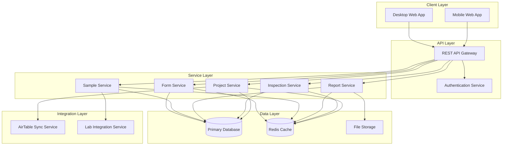

# Technical Architecture

## 1. System Architecture Overview

## 2. Component Details

### 2.1 Client Layer
- **Mobile Web App**: Progressive Web App (PWA) for field operations
  - Offline data storage
  - Form data collection
  - Equipment management
  - Sample tracking

- **Desktop Web App**: Admin interface
  - Project management
  - Report generation
  - Data analysis
  - System configuration

### 2.2 API Layer
- **REST API Gateway**: Central entry point
  - Request routing
  - Rate limiting
  - API versioning
  - Response caching

- **Authentication Service**
  - JWT-based authentication
  - Role-based access control
  - Session management

### 2.3 Service Layer
- **Project Service**
  - Project management
  - AirTable synchronization
  - Assignment tracking

- **Inspection Service**
  - Digital form management
  - Equipment tracking
  - Field data collection

- **Report Service**
  - Template management
  - PDF generation
  - Data aggregation

- **Sample Service**
  - Sample tracking
  - Lab result management
  - Notification system

- **Form Service**
  - Dynamic form generation
  - Form validation
  - Data persistence

### 2.4 Integration Layer
- **AirTable Sync Service**
  - Daily data synchronization
  - Error handling
  - Conflict resolution

- **Lab Integration Service**
  - Lab result processing
  - Status tracking
  - Notification dispatch

### 2.5 Data Layer
- **Primary Database**: PostgreSQL
  - ACID compliance
  - Complex querying
  - Data integrity

- **Redis Cache**
  - Session storage
  - API response caching
  - Temporary data storage

- **File Storage**: S3-compatible
  - Report storage
  - Document management
  - Media files

## 3. Technical Stack

### 3.1 Frontend
- React.js with TypeScript
- Material-UI components
- PWA capabilities
- Service Workers for offline support
- Redux for state management

### 3.2 Backend
- Node.js with Express
- TypeScript
- PostgreSQL
- Redis
- S3-compatible storage

### 3.3 DevOps
- Docker containers
- CI/CD pipeline
- Automated testing
- Monitoring and logging
- Backup and disaster recovery

## 4. Security Measures
- SSL/TLS encryption
- JWT authentication
- Role-based access control
- Data encryption at rest
- Regular security audits
- Input validation
- XSS and CSRF protection
