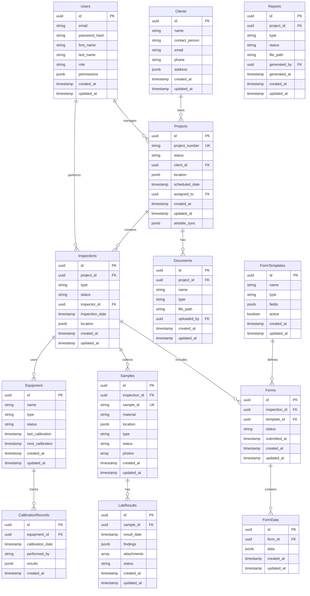

# Database Design (ER Diagram)

## Table Descriptions

### Users
Stores user information including authentication and authorization details.

### Projects
Central table for project management, linked to AirTable sync data.

### Clients
Contains client information for projects.

### Inspections
Tracks individual inspection events within projects.

### Forms
Manages digital forms used during inspections.

### FormTemplates
Defines structure and validation rules for different form types.

### FormData
Stores actual form data submitted during inspections.

### Samples
Tracks samples collected during inspections.

### LabResults
Stores laboratory analysis results for collected samples.

### Equipment
Manages inspection equipment inventory.

### CalibrationRecords
Tracks equipment calibration history.

### Reports
Manages generated inspection reports.

### Documents
Stores project-related documents and attachments.

## Key Features

1. **UUID Primary Keys**
   - Ensures globally unique identifiers
   - Supports distributed systems
   - Prevents ID conflicts

2. **Timestamps**
   - Created_at and updated_at for audit trails
   - Supports data synchronization
   - Enables change tracking

3. **JSONB Fields**
   - Flexible schema for dynamic data
   - Efficient storage and querying
   - Supports complex data structures

4. **Foreign Keys**
   - Maintains referential integrity
   - Enables complex relationships
   - Supports cascading operations

5. **Indexing Strategy**
   - Primary keys (B-tree)
   - Foreign keys (B-tree)
   - JSONB fields (GIN)
   - Text search fields (GiST)

## Data Types

- **uuid**: Unique identifiers
- **string**: VARCHAR(255) for text
- **jsonb**: JSON Binary for complex data
- **timestamp**: Timestamps with timezone
- **array**: Array types for multiple values
- **boolean**: True/False values
