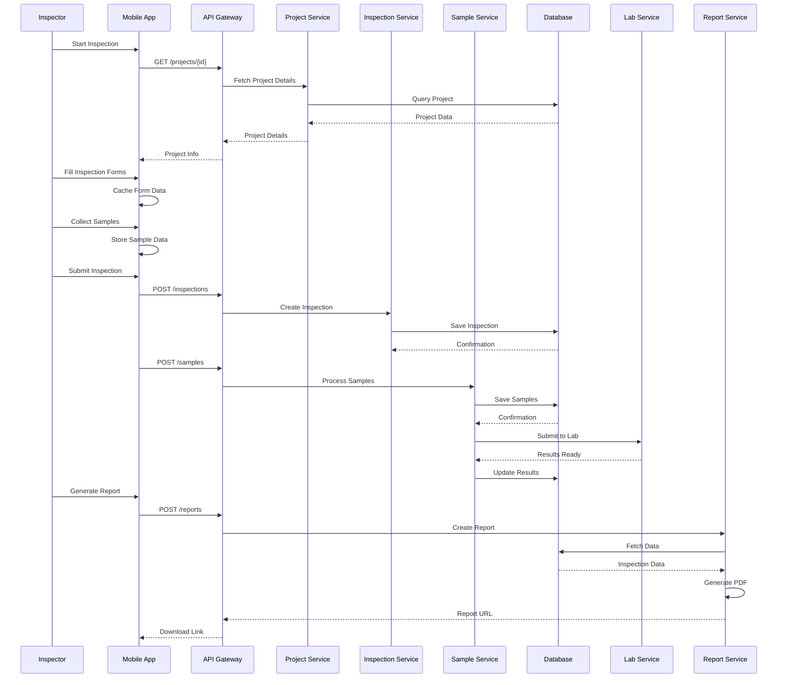
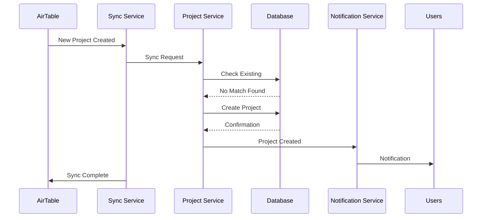
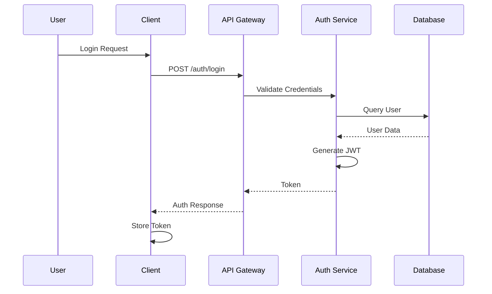
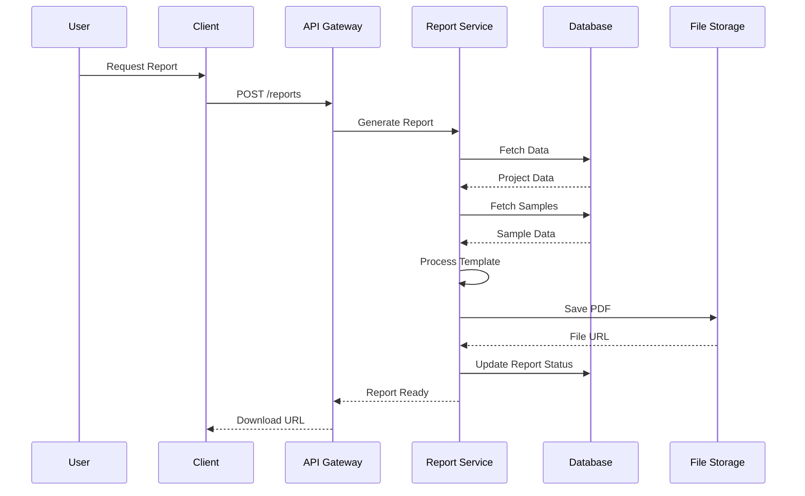
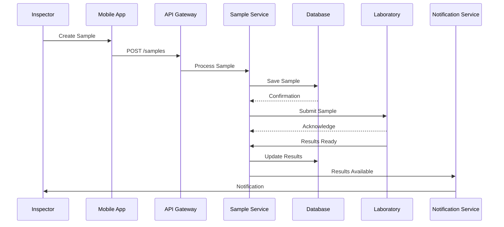

# Sequence Diagrams

## 1. Inspection Workflow

## 2. Project Creation and Sync

## 3. Authentication Flow

## 4. Report Generation

## 5. Sample Management

These sequence diagrams illustrate the key workflows in the system, showing the interaction between different components and services. They help visualize:

1. The complete inspection process
2. Project synchronization with AirTable
3. User authentication flow
4. Report generation process
5. Sample management workflow

Each diagram shows:
- Component interactions
- Data flow
- Asynchronous processes
- Error handling points
- User touchpoints
